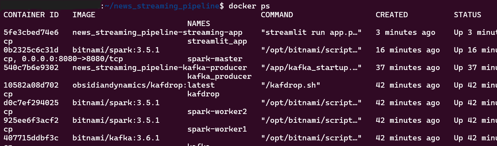
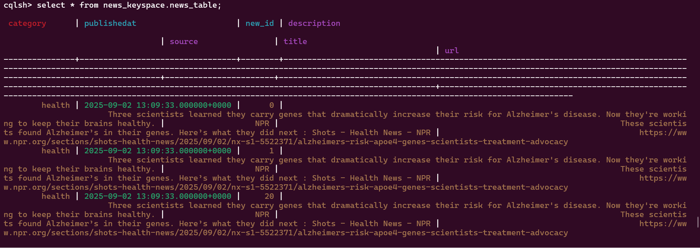
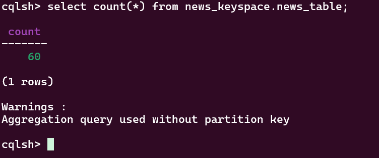
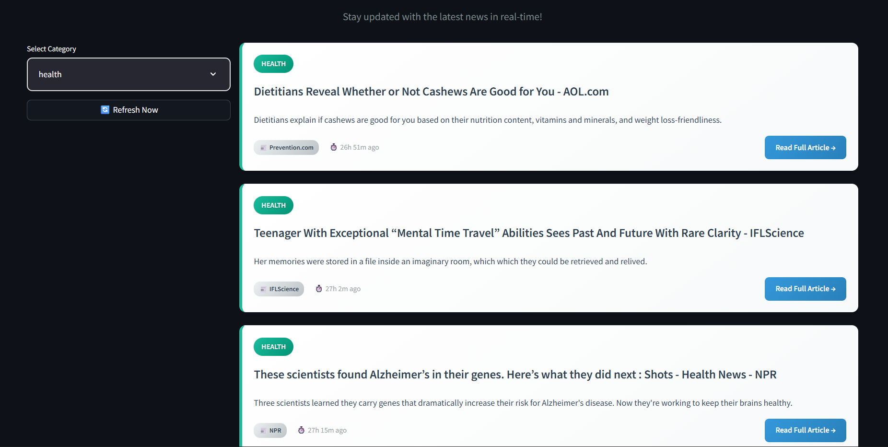
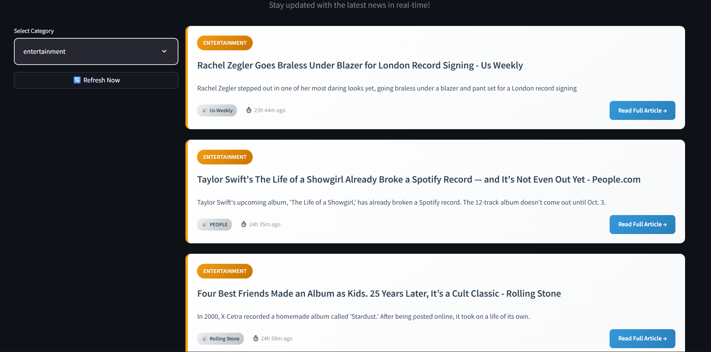

# Real-Time News Pipeline
This project implements a **Real-Time News Pipeline** that continuously extracts news articles from an API, streams them via Kafka, processes them using Apache Spark, stores the structured data in Cassandra, and visualizes the results with a Streamlit dashboard. It demonstrates a complete end-to-end real-time data engineering workflow, combining ingestion, streaming, processing, storage, and visualization in one integrated system.
## Project Structure
```bash
bassamoh32-realtime-news-pipeline/
├── README.md                 # Project documentation
├── docker-compose.yml        # Docker setup for all services
├── .env.example              # Example environment variables
├── cassandra_utils/          # Utilities to manage Cassandra
│   ├── __init__.py
│   ├── cassandra_manager.py  # Cassandra connection and queries
│   └── cassandra_schema.py   # Cassandra schema definitions
├── configuration/            # Configuration files for each component
│   ├── cassandra.yml
│   ├── kafka.yml
│   └── source_api.yml
├── kafka/                    # Kafka producer setup
│   ├── Dockerfile
│   ├── kafka_producer.py     # Producer sending news to Kafka topic
│   ├── kafka_startup.sh      # Script to start Kafka container
│   └── requirements.txt
├── spark/                    # Spark consumer setup
│   └── utils/
│       ├── requirements.txt
│       ├── spark_consumer.py # Spark streaming job consuming Kafka data
│       └── spark_startup.sh  # Script to start Spark container
└── streamlit_UI/             # Streamlit dashboard for visualization
    ├── app.py
    ├── Dockerfile
    └── requirements.txt
```

## Features
1. **Real-Time Data Ingestion**
Fetches news articles from a configured news API continuously.

2. **Kafka Streaming**
Uses Kafka producer to publish news data to topics and Spark consumer to process streams.

3. **Data Storage with Cassandra**
Processed news is stored in Cassandra tables for fast retrieval and query performance.

4. **Visualization Dashboard**
Streamlit UI to view real-time news data, with filtering by category or source.

5. **Containerized Deployment**
Docker and docker-compose used to orchestrate services for easy setup and scalability.

## How It Works
1. **Kafka Producer**

    * Fetches news from the source API (source_api.yml).
    * Publishes news messages to a Kafka topic.

2. **Spark Consumer**

    * Subscribes to Kafka topic.
    * Processes and transforms news data.
    * Inserts data into Cassandra keyspace and tables.

3. **Cassandra Storage**

    * Stores structured news data with proper schema management.

4. **Streamlit UI**

    * Connects to Cassandra.
    * Displays real-time news in a user-friendly dashboard.
## How To Run 
1. **Clone the repository** to your local machine.
2. **Run all services** with Docker Compose: 
```bash 
docker compose up --build 
```
3. **Verify services** are running:
```bash
docker ps
``` 

4. **Run the Spark job**:
* Enter the Spark container:
```bash
docker exec -it spark-master bash
```
* Start the Spark consumer:
```bash
utils/spark_startup.sh
```
This creates the Cassandra keyspace and table, then consumes news from the Kafka topic (news) and inserts it into Cassandra.
5. **Verify data in Cassandra**:
* Enter Cassandra container:
```bash 
docker exec -it cassandra cqlsh
```
* You should see your news data:


6. **View the Streamlit dashboard**:
Open your browser at ``http://localhost:8501/`` to see real-time news data:


